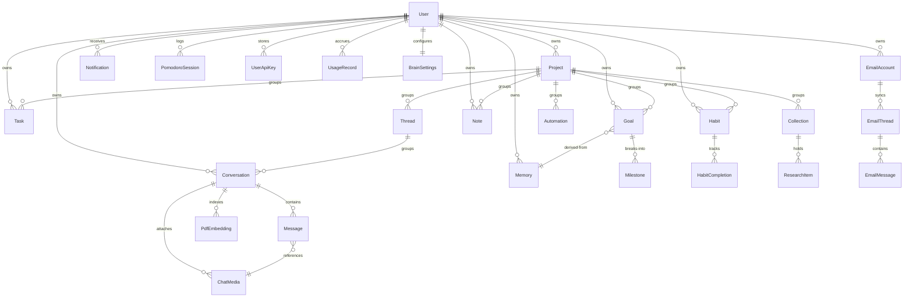

# ToolStackAI — Documentation

> An AI-powered personal operating system built with Express 5 + TypeScript (backend) and React 19 + Vite + Tailwind v4 (frontend).

---

## Table of Contents

- [1. Overview](#1-overview)
- [2. Project Structure](#2-project-structure)
- [3. Backend Architecture](#3-backend-architecture)
  - [3.1 Middleware Stack](#31-middleware-stack)
  - [3.2 Route Registry](#32-route-registry)
  - [3.3 Feature Module Pattern](#33-feature-module-pattern)
  - [3.4 Persistence Layers](#34-persistence-layers)
- [4. Frontend Architecture](#4-frontend-architecture)
  - [4.1 Component Hierarchy](#41-component-hierarchy)
  - [4.2 State Management](#42-state-management)
  - [4.3 Service Layer](#43-service-layer)
  - [4.4 Routing](#44-routing)
- [5. API Reference](#5-api-reference)
- [6. AI Integration](#6-ai-integration)
  - [6.1 NVIDIA Provider](#61-nvidia-provider)
  - [6.2 Prompt Composition](#62-prompt-composition)
  - [6.3 Tool Calling](#63-tool-calling)
  - [6.4 Vision API](#64-vision-api)
  - [6.5 Embeddings](#65-embeddings)
  - [6.6 Bring-Your-Own-Key](#66-bring-your-own-key)
- [7. Real-Time & Notifications](#7-real-time--notifications)
- [8. Feature Pipelines](#8-feature-pipelines)
  - [8.1 Authentication](#81-authentication)
  - [8.2 Chat (Streaming + Tools)](#82-chat-streaming--tools)
  - [8.3 Vision Chat](#83-vision-chat)
  - [8.4 Document Chat (RAG)](#84-document-chat-rag)
  - [8.5 Mail (IMAP + AI Triage)](#85-mail-imap--ai-triage)
  - [8.6 Productivity AI](#86-productivity-ai)
  - [8.7 Theme System](#87-theme-system)
- [9. Data Model](#9-data-model)
- [10. Configuration & Environment](#10-configuration--environment)
- [11. Quick Start](#11-quick-start)
- [12. Deployment](#12-deployment)
- [13. Known Gaps](#13-known-gaps)

---

## 1. Overview

ToolStackAI is a single-user-per-account workspace that combines an AI assistant with a productivity suite. The assistant can read and write your workspace data through tool calling, so "add a task to ship the invoice by Friday" creates a real `Task` row.

**AI surfaces**

| Feature | What it does |
|---------|-------------|
| **Chat** | Streaming chat completions over SSE, with tool calling, long-term memory, and workspace context |
| **Document Chat (RAG)** | Upload a PDF into a conversation; chunks are embedded and retrieved per question |
| **Vision Chat** | Attach an image inline in chat for multimodal conversation |
| **Brain** | Long-term memory store with auto-extraction, categories, importance, pinning, and retention settings |
| **Mail** | Connect an IMAP account; AI categorizes threads, scores urgency, summarizes, extracts action items, and drafts replies |
| **Briefing** | Generated daily digest across tasks, habits, goals, and mail |
| **Image Analysis** | Structured vision analysis (objects, issues, recommendations) — *backend only, UI disabled* |
| **Code Debugger** | Structured bug report + fixes from pasted code — *backend only, UI disabled* |

**Productivity surfaces**

| Feature | What it does |
|---------|-------------|
| **Tasks** | CRUD, priority/status/tags/due dates, AI creation from natural language, AI priority suggestions |
| **Habits** | Frequency-based tracking, completions, streak stats, AI creation, AI insights |
| **Goals** | Milestones, progress, AI milestone suggestions, AI progress analysis |
| **Notes** | Markdown notes with tags, full-text search, AI summarize, AI task extraction |
| **Projects** | Grouping container for tasks, goals, notes, habits, collections, automations, threads |
| **Pomodoro** | Focus/break sessions with persisted history and stats |
| **Media & Files** | Chat media gallery and general file storage backed by Supabase buckets |
| **Dashboard** | Cross-feature aggregate view |
| **Notifications** | Socket.io-pushed notifications for mail, task, and habit events |
| **Themes** | 12 built-in themes with live CSS-variable injection, customization, and persistence |

**Stack**

| Layer | Technology |
|-------|-----------|
| Backend framework | Express 5, TypeScript 6, ESM (`"type": "module"`) |
| Database | PostgreSQL via Prisma 7 (driver adapter `@prisma/adapter-pg`) |
| Object storage | Supabase Storage (`pdfs`, `images`, `avatars`, `exports` buckets) |
| AI provider | NVIDIA NIM — `llama-3.1-8b-instruct`, `nemotron-nano-12b-v2-vl`, `llama-nemotron-embed-vl-1b-v2` |
| Real-time | Socket.io 4 (JWT-authenticated, per-user rooms) |
| Mail | `imapflow` (fetch), `mailparser` (parse), `nodemailer` (send) |
| Frontend framework | React 19, TypeScript 6 |
| Build tool | Vite 8 + Tailwind CSS v4 (`@tailwindcss/vite`) |
| State management | React Query (server state), React Context (auth, theme, pomodoro) |
| Routing | React Router v7 (lazy-loaded routes) |
| Auth | JWT (`jsonwebtoken`, 7-day expiry), bcrypt |
| Validation | Zod 4 (both sides) |
| Logging | pino |

---

## 2. Project Structure

```
toolstack-ai/
├── backend/
│   ├── build.js                        # Build script — prisma generate + tsc
│   ├── prisma/
│   │   ├── schema.prisma               # 27 models
│   │   └── migrations/
│   ├── src/
│   │   ├── app.ts                      # Express app — middleware + all route mounts
│   │   ├── server.ts                   # Entry — HTTP server, Socket.io, 15-min cron
│   │   ├── ai/
│   │   │   ├── providers/nvidia.ts     # NVIDIA client (chatCompletion, chatCompletionStream)
│   │   │   ├── prompts/prompts.ts      # Composable system prompts
│   │   │   ├── embeddings/embeddings.ts# Embedding generation + text chunking
│   │   │   └── vector-store/           # VectorStore interface + in-memory cosine impl
│   │   ├── config/supabase.ts          # Supabase service-role client
│   │   ├── features/                   # 19 feature modules (see §3.2)
│   │   │   ├── api-keys/  auth/  brain/  briefing/  chat/  dashboard/
│   │   │   ├── debug/  files/  goals/  habits/  image/  mail/  media/
│   │   │   └── notes/  notifications/  pdf/  pomodoro/  projects/  tasks/
│   │   ├── services/
│   │   │   ├── storage.service.ts       # Supabase bucket upload/download/delete
│   │   │   └── storage.errors.ts
│   │   ├── shared/
│   │   │   ├── db/prismaClient.ts       # Lazy Prisma singleton via pg adapter
│   │   │   ├── middleware/              # authenticate, errorHandler, requestLogger
│   │   │   ├── socket/socketManager.ts  # Socket.io init + createAndSendNotification
│   │   │   └── utils/                   # multer, logger, encryption, ai-error-handler
│   │   ├── tools/web-search/            # Web search tool for chat
│   │   ├── generated/prisma/            # Generated Prisma client (gitignored output)
│   │   └── types/express/index.d.ts     # req.user augmentation
│   └── .env.example
│
├── frontend/
│   ├── src/
│   │   ├── App.tsx                     # Root — providers
│   │   ├── config.ts                   # Typed env accessor with defaults
│   │   ├── api/client.ts               # Axios instance + JWT/401 interceptors
│   │   ├── routes/index.tsx            # Lazy route definitions
│   │   ├── layouts/app-layout.tsx      # Sidebar + Topbar + Outlet
│   │   ├── store/                      # auth.tsx, theme.tsx, pomodoro.tsx
│   │   ├── services/                   # 19 typed API wrappers
│   │   ├── pages/                      # 18 page components
│   │   ├── components/
│   │   │   ├── layout/                 # sidebar, topbar, command-palette, user-menu
│   │   │   ├── chat/                   # composer, message-block
│   │   │   ├── brain/                  # memory-card, memory-detail-panel
│   │   │   ├── notifications/          # notification-panel
│   │   │   ├── landing/                # animation primitives
│   │   │   ├── theme/                  # theme-modal, theme-card, preview-panel
│   │   │   └── ui/                     # button, dialog, input, select, tabs, toast, …
│   │   ├── themes/                     # 12 themes, types, deriveColors util
│   │   ├── types/api.ts                # Shared interfaces
│   │   └── index.css                   # Tailwind + CSS variables
│   ├── .env.example
│   └── vite.config.ts                  # Dev proxy + `@` path alias
│
├── openspec/                           # Spec-driven development artifacts
├── uploads/                            # Local multer scratch space (pdfs/, images/)
├── docs/
└── render.yaml                         # Render deployment blueprint
```

---

## 3. Backend Architecture

### 3.1 Middleware Stack

Applied in order in [`backend/src/app.ts`](backend/src/app.ts):

```
Request
  │
  ▼
helmet()                     ← Security headers
  │
  ▼
cors()                       ← Open CORS (no origin allowlist)
  │
  ▼
express-rate-limit           ← 100 requests / 60s per IP, standard headers
  │
  ▼
requestLogger                ← pino: method, URL, status, duration
  │
  ▼
express.json (1mb)           ← JSON bodies
  │
  ▼
express.urlencoded (1mb)     ← URL-encoded bodies
  │
  ▼
GET /health                  ← { success, timeStamp, message } — no auth
  │
  ▼
19 route mounts              ← see §3.2 (all authenticated except /api/auth login+register)
  │
  ▼
errorHandler                 ← Normalizes to { success: false, message }
```

### 3.2 Route Registry

| Mount | Module | Auth |
|-------|--------|------|
| `/api/auth` | `auth` | Mixed |
| `/api/chat` | `chat` (conversation + message routers, both mounted here) | Yes |
| `/api/pdf` | `pdf` | Yes |
| `/api/image` | `image` | Yes |
| `/api/debug` | `debug` | Yes |
| `/api/brain` | `brain` | Yes |
| `/api/keys` | `api-keys` | Yes |
| `/api/dashboard` | `dashboard` | Yes |
| `/api/media` | `media` | Yes |
| `/api/files` | `files` | Yes |
| `/api/habits` | `habits` | Yes |
| `/api/notes` | `notes` | Yes |
| `/api/tasks` | `tasks` | Yes |
| `/api/goals` | `goals` | Yes |
| `/api/briefing` | `briefing` | Yes |
| `/api/projects` | `projects` | Yes |
| `/api/pomodoro` | `pomodoro` | Yes |
| `/api/mail` | `mail` | Yes |
| `/api/notifications` | `notifications` | Yes |

> `/api/chat` hosts two routers — `conversation.routes.ts` (conversation CRUD) and `message.routes.ts` (messages, stream, vision). Express merges them at the same prefix.

### 3.3 Feature Module Pattern

Every feature is a self-contained folder. Not all features have every file — `validator.ts` exists only where Zod validation is applied.

```
src/features/<name>/
├── <name>.routes.ts      ← Express Router: paths + authenticate + multer
├── <name>.controller.ts  ← req/res handling, delegates to service
├── <name>.service.ts     ← Business logic, Prisma queries, AI calls
└── <name>.validator.ts   ← Zod schemas (optional)
```

Request flow:

```
Browser → Router → authenticate → [multer] → Controller
  → Service (Prisma / NVIDIA / Supabase / IMAP)
  → Response { success, data }
```

Controllers never touch Prisma directly. The `chat` feature is the exception to the one-service rule — it splits into `conversation.service`, `message.service`, `chat-completion.service`, `vision.service`, and `tool-executor`.

### 3.4 Persistence Layers

Three distinct stores, used for different things:

| Store | Client | Used for |
|-------|--------|----------|
| **PostgreSQL** | Prisma 7 via `PrismaPg` driver adapter | All relational data (27 models) |
| **Supabase Storage** | `@supabase/supabase-js` service-role client | Durable file blobs — buckets `pdfs`, `images`, `avatars`, `exports` (private, 10 MB cap, auto-created on boot) |
| **Local disk** | multer, `./uploads/{pdfs,images}` | Short-lived upload scratch space; files are deleted after processing |

The Prisma datasource declares only `provider = "postgresql"` — the connection string is supplied at runtime by the driver adapter from `DATABASE_URL`, and the client is generated to `src/generated/prisma`.

**Vector storage** has two implementations. `PdfEmbedding` (Postgres, `vector Float[]`) is the durable per-conversation store; `InMemoryVectorStore` is a cosine-similarity implementation behind the `VectorStore` interface in `ai/vector-store/`.

---

## 4. Frontend Architecture

### 4.1 Component Hierarchy

```
<QueryClientProvider>
  <BrowserRouter>
    <AuthProvider>                ← user + token, login/logout
      <ThemeProvider>             ← theme state, CSS variable injection
        <PomodoroProvider>        ← timer state, survives navigation
          <AppRoutes>             ← lazy-loaded, <Suspense> spinner fallback
            ├── /         → <LandingPage>
            ├── /login    → <LoginPage>
            ├── /register → <RegisterPage>
            └── <AppLayout>       ← Sidebar + Topbar + NotificationPanel + <Outlet>
                  ├── /dashboard     → <DashboardPage>
                  ├── /chat, /chat/:id → <ChatPage>   (also hosts document + vision chat)
                  ├── /mail          → <MailPage>
                  ├── /tasks         → <TasksPage>
                  ├── /habits        → <HabitsPage>
                  ├── /projects      → <ProjectsPage>
                  ├── /notes         → <NotesPage>
                  ├── /pomodoro      → <PomodoroPage>
                  ├── /goals         → <GoalsPage>
                  ├── /media         → <MediaPage>
                  ├── /brain         → <BrainPage>
                  ├── /conversations → <ConversationsPage>
                  └── /settings      → <SettingsPage>
        </PomodoroProvider>
      </ThemeProvider>
    </AuthProvider>
  </BrowserRouter>
</QueryClientProvider>
```

Unmatched paths redirect to `/`.

### 4.2 State Management

| Concern | Solution | Scope |
|---------|----------|-------|
| Server state (tasks, threads, memories, …) | React Query | Global |
| Auth (user, token) | `AuthProvider` context | Global |
| Theme config | `ThemeProvider` context | Global |
| Pomodoro timer | `PomodoroProvider` context | Global (persists across routes) |
| Live notifications | Socket.io client → React Query invalidation | Global |
| Streaming text, drafts, modals | Local `useState` / `useRef` | Per component |
| Sidebar conversation list | `useInfiniteQuery` | Sidebar |

### 4.3 Service Layer

`src/services/*.ts` wrap API calls with typed responses — one per feature: `auth`, `brain`, `briefing`, `chat`, `dashboard`, `debug`, `files`, `goals`, `habits`, `image`, `keys`, `mail`, `media`, `notes`, `notifications`, `pdf`, `pomodoro`, `projects`, `tasks`.

The Axios instance ([`src/api/client.ts`](frontend/src/api/client.ts)) automatically:
- attaches `Authorization: Bearer <token>` from localStorage
- redirects to `/login` on 401

Streaming is the exception — `chat.service.ts` uses `fetch` with a `ReadableStream` reader, since Axios can't consume SSE incrementally.

### 4.4 Routing

All authenticated routes nest under `<AppLayout>`. Every page is `lazy()`-imported for code splitting. `<ThemeModal>` mounts in `AppLayout` and is controlled via `useTheme()`; the command palette is driven by `use-command-palette.ts`.

---

## 5. API Reference

All endpoints return `{ success, data }` on success and `{ success: false, message }` on error. All require `Authorization: Bearer <token>` except register and login.

### Auth — `/api/auth`

| Method | Path | Auth | Body |
|--------|------|------|------|
| POST | `/register` | No | `{ email, password, fullName }` → `{ token, user }` |
| POST | `/login` | No | `{ email, password }` → `{ token, user }` |
| PUT | `/me` | Yes | `{ fullName? }` |
| PUT | `/password` | Yes | `{ currentPassword, newPassword }` |

JWT payload: `{ userId, email, fullName }`, 7-day expiry.

### Chat — `/api/chat`

| Method | Path | Notes |
|--------|------|-------|
| GET | `/conversations` | List conversations |
| POST | `/conversations` | `{ title? }` |
| DELETE | `/conversations` | Delete all |
| DELETE | `/conversations/:id` | Also deletes associated stored file |
| PATCH | `/conversations/:id` | `{ title? }` |
| POST | `/message` | Non-streaming completion |
| GET | `/message?conversationId=` | Message history |
| POST | `/stream` | SSE — `data: { content }` chunks |
| POST | `/vision` | `multipart/form-data: { image, message, conversationId }` |

### PDF — `/api/pdf`

| Method | Path | Notes |
|--------|------|-------|
| POST | `/upload` | `multipart/form-data: { file }` — PDF only, 10 MB max |
| POST | `/chat` | `{ message, documentId }` — RAG answer |
| GET | `/:id/file` | Streams the stored PDF |

### Brain — `/api/brain`

| Method | Path |
|--------|------|
| GET | `/dashboard` |
| GET | `/memories` · `/memories/:id` |
| POST | `/memories` |
| PATCH | `/memories/:id` |
| DELETE | `/memories/:id` · `/memories` (all) |
| GET / PATCH | `/settings` |

### Mail — `/api/mail`

| Method | Path | Notes |
|--------|------|-------|
| POST | `/accounts` | Add IMAP/SMTP account (password encrypted at rest) |
| GET | `/accounts` | List accounts |
| DELETE | `/accounts/:id` | Remove account |
| POST | `/accounts/test-connection` | Validate credentials before saving |
| POST | `/accounts/:id/sync` | Fetch new mail over IMAP |
| GET | `/threads` | Thread list (filterable) |
| GET | `/threads/:id` | Thread + messages |
| POST | `/threads/:id/categorize` | AI category + urgency + summary + action items |
| POST | `/categorize-all` | Batch categorize |
| POST | `/draft` | AI reply draft (preset + tone) |
| POST | `/send` | Send via SMTP |

### Tasks — `/api/tasks`

| Method | Path | Notes |
|--------|------|-------|
| POST / GET | `/` | Create / list |
| GET | `/:id` · PATCH `/:id` · DELETE `/:id` | |
| POST | `/ai-create` | Natural language → structured task |
| GET | `/ai-suggestions` | AI priority ordering |

### Goals — `/api/goals`

| Method | Path |
|--------|------|
| POST / GET | `/` |
| GET / PATCH / DELETE | `/:id` |
| POST | `/:id/milestones` |
| PATCH / DELETE | `/:id/milestones/:mid` |
| POST | `/:id/ai-milestones` |
| GET | `/:id/ai-analysis` |

### Habits — `/api/habits`

| Method | Path |
|--------|------|
| POST / GET | `/` |
| PATCH / DELETE | `/:id` |
| GET | `/:id/stats` |
| POST | `/:id/complete` |
| POST | `/ai-create` |
| GET | `/ai-insights` |

### Notes — `/api/notes`

| Method | Path |
|--------|------|
| POST / GET | `/` |
| GET | `/search?q=` |
| GET / PATCH / DELETE | `/:id` |
| POST | `/:id/summarize` |
| POST | `/:id/extract-tasks` |

### Other

| Feature | Endpoints |
|---------|-----------|
| **Projects** `/api/projects` | POST `/`, GET `/`, GET/PATCH/DELETE `/:id` |
| **Pomodoro** `/api/pomodoro` | POST `/sessions`, GET `/sessions`, GET `/stats` |
| **Notifications** `/api/notifications` | GET `/`, PATCH `/:id/read`, PATCH `/read-all`, DELETE `/clear` |
| **Files** `/api/files` | GET `/`, GET `/:id`, POST `/upload`, DELETE `/:id` |
| **Media** `/api/media` | GET `/`, GET `/file/:id`, DELETE `/:id` |
| **API Keys** `/api/keys` | GET `/status`, GET `/`, POST `/`, POST `/test`, DELETE `/:provider` |
| **Dashboard** `/api/dashboard` | GET `/` |
| **Briefing** `/api/briefing` | GET `/` |
| **Image** `/api/image` | POST `/analyze` (multipart `image`) |
| **Debug** `/api/debug` | POST `/` — `{ code, language }` |

**Upload limits** ([`shared/utils/multer.ts`](backend/src/shared/utils/multer.ts)): 10 MB for both. PDFs must be `application/pdf`; images must be `image/jpeg`, `image/png`, or `image/webp`.

---

## 6. AI Integration

### 6.1 NVIDIA Provider

File: [`backend/src/ai/providers/nvidia.ts`](backend/src/ai/providers/nvidia.ts)

```typescript
export const nvidia = {
  chatCompletion(messages, options?)       → Promise<ChatCompletionResponse>,
  chatCompletionStream(messages, options?) → AsyncGenerator<string>,
}
```

Both POST to `https://integrate.api.nvidia.com/v1/chat/completions`. The streaming variant parses SSE `data:` lines and yields `choices[0].delta.content`, stopping on `[DONE]`. Malformed chunks are skipped rather than throwing. Defaults: `temperature 0.7`, `max_tokens 1024`.

`options.apiKey` overrides the environment key — this is how bring-your-own-key works (§6.6).

**Models (configurable via env):**

| Purpose | Env Var | Default |
|---------|---------|---------|
| Chat / streaming | `NVIDIA_CHAT_MODEL` | `meta/llama-3.1-8b-instruct` |
| Vision | `NVIDIA_VISION_MODEL` | `nvidia/nemotron-nano-12b-v2-vl` |
| Embeddings | `NVIDIA_EMBED_MODEL` | `nvidia/llama-nemotron-embed-vl-1b-v2` |

### 6.2 Prompt Composition

[`ai/prompts/prompts.ts`](backend/src/ai/prompts/prompts.ts) exports composable fragments rather than one monolithic prompt. `chatSystemPrompt()` assembles them:

```
chatSystemPrompt(memoryContext?, workspaceContext?, searchContext?)
  │
  ├── chatPersonaPrompt()        ← Identity and voice
  ├── toolPrompt()               ← Available tools and call format
  ├── responseStrategyPrompt()   ← Length/format heuristics
  ├── memoryPrompt(memory)       ← Retrieved long-term memories
  ├── workspacePrompt(workspace) ← Current tasks/habits/goals snapshot
  └── searchPrompt(search)       ← Web search results, when used
```

Feature-specific prompts: `pdfRagPrompt(context, question)`, `imageAnalysisPrompt()`, `memoryExtractionPrompt(message)`, `codeDebuggerPrompt(code, language)`.

### 6.3 Tool Calling

[`features/chat/tool-executor.ts`](backend/src/features/chat/tool-executor.ts) dispatches model-emitted tool calls against the user's real data. Eight tools:

| Tool | Effect |
|------|--------|
| `create_task` | Creates a task via the AI task parser |
| `mark_task_done` / `mark_task_undone` | Fuzzy title match (case-insensitive `contains`), flips status |
| `update_task_status` | Sets `todo` \| `in-progress` \| `done` \| `archived` |
| `create_habit` | Creates a habit via the AI habit parser |
| `create_goal` | Creates a goal plus a seed milestone |
| `create_project` | Creates a project |
| `save_memory` | Writes to the Brain memory store |

Every tool returns `{ success, message }`, and the message (e.g. `✓ Created task "Ship invoice" (high)`) is surfaced back into the conversation. Executions are logged to `ToolExecution`.

A **web search** tool lives separately in [`tools/web-search/`](backend/src/tools/web-search), gated on `SEARCH_API_KEY`, returning `{ title, url, description }[]`.

### 6.4 Vision API

The vision path calls NVIDIA directly via `fetch` rather than through the `nvidia` provider, because the request body carries multimodal content:

```jsonc
{
  "model": "nvidia/nemotron-nano-12b-v2-vl",
  "messages": [
    { "role": "system", "content": "..." },
    { "role": "user", "content": [
      { "type": "image_url", "image_url": { "url": "data:image/jpeg;base64,..." } },
      { "type": "text", "text": "Analyze this image..." }
    ]}
  ]
}
```

Uploaded images are read to base64, sent, then the temp file is deleted.

### 6.5 Embeddings

File: [`ai/embeddings/embeddings.ts`](backend/src/ai/embeddings/embeddings.ts)

The embedding model is **asymmetric** — it requires an `input_type`:

| Use case | `input_type` |
|----------|-------------|
| Document chunks (indexing) | `"passage"` |
| User questions (search) | `"query"` |

```typescript
generateEmbedding(text, "passage")  // at ingest
generateEmbedding(text, "query")    // at search
```

Using the wrong one silently degrades retrieval quality — no error is raised.

**Chunking:** split on sentence boundaries, default max 500 chars, no overlap, embedded with concurrency 3.

### 6.6 Bring-Your-Own-Key

Users can store their own provider keys. `UserApiKey` holds `encryptedKey` (AES via [`shared/utils/encryption.ts`](backend/src/shared/utils/encryption.ts), keyed by `ENCRYPTION_KEY`), unique per `(userId, provider)`. `POST /api/keys/test` validates a key before saving. `UsageRecord` tracks `provider`, `model`, `tokens`, and `cost` per call.

---

## 7. Real-Time & Notifications

[`shared/socket/socketManager.ts`](backend/src/shared/socket/socketManager.ts) initializes Socket.io on the same HTTP server as Express.

```
Client connects with { auth: { token } }
  │
  ▼
io.use() middleware
  ├── Extract token from handshake.auth.token || handshake.query.token
  ├── jwt.verify(token, JWT_SECRET)
  └── socket.data.userId = decoded.id        ⚠️ see §13
  │
  ▼
on("connection")
  └── socket.join(`user:${userId}`)          ← per-user room
```

Server-side pushes go through one helper:

```typescript
createAndSendNotification(userId, { type, title, message, link? })
  ├── prisma.notification.create(...)              ← durable row
  └── io.to(`user:${userId}`).emit("new_notification", notification)
```

`type` is one of `mail` \| `task` \| `habit` \| `system`; `link` deep-links into the UI (`/mail`, `/tasks`, `/habits`).

**Scheduled work.** [`server.ts`](backend/src/server.ts) runs two jobs on boot and every 15 minutes:

```
setInterval(15 min)
  ├── cleanupOverdueTasks()                 ← tasks feature
  └── checkDueTaskAndHabitReminders()        ← emits notifications
```

This is an in-process interval, not a job queue — it does not survive across multiple instances and will double-fire if the service is scaled horizontally.

---

## 8. Feature Pipelines

### 8.1 Authentication

```
User              Frontend                 Backend                   Database
 │                   │                        │                         │
 │  Register/Login   │                        │                         │
 │──────────────────►│                        │                         │
 │                   │ POST /api/auth/login   │                         │
 │                   │───────────────────────►│                         │
 │                   │                        │ SELECT user WHERE email │
 │                   │                        │────────────────────────►│
 │                   │                        │◄────────────────────────│
 │                   │                        │ bcrypt.compare()        │
 │                   │                        │ jwt.sign({ userId,      │
 │                   │                        │   email, fullName })    │
 │                   │◄─── { token, user } ───│                         │
 │                   │ localStorage.setItem   │                         │
 │◄──── Redirect ────│                        │                         │
 │                   │                        │                         │
 │  Protected call   │ Authorization: Bearer  │                         │
 │──────────────────►│───────────────────────►│                         │
 │                   │                        │ jwt.verify()            │
 │                   │                        │ findUnique(decoded.     │
 │                   │                        │   userId)  ← re-checked │
 │                   │                        │ req.user = { id, email }│
 │                   │◄────── Response ───────│◄────────────────────────│
```

`authenticate` re-queries the user on every request, so a deleted account is rejected immediately (`"User no longer exists"`) rather than living until token expiry.

### 8.2 Chat (Streaming + Tools)

```
User          ChatPage            /api/chat/stream         NVIDIA            Database
 │                │                      │                    │                 │
 │ Send           │                      │                    │                 │
 │───────────────►│                      │                    │                 │
 │                │ optimistic user msg  │                    │                 │
 │                │ POST /stream         │                    │                 │
 │                │─────────────────────►│                    │                 │
 │                │                      │ Save user message  │                 │
 │                │                      │───────────────────────────────────►  │
 │                │                      │ Load history (last 50, desc+reverse) │
 │                │                      │◄──────────────────────────────────   │
 │                │                      │                    │                 │
 │                │                      │ Build system prompt:                 │
 │                │                      │  persona + tools + strategy          │
 │                │                      │  + memories + workspace + search     │
 │                │                      │                    │                 │
 │                │                      │ POST /chat/completions (stream:true) │
 │                │                      │───────────────────►│                 │
 │                │ data:{content} ◄─────│◄── SSE deltas ─────│                 │
 │                │ (rAF-throttled)      │                    │                 │
 │                │                      │                    │                 │
 │                │            [if stream fails / empty]      │                 │
 │                │                      │ chatCompletion()  ← non-stream fallback
 │                │                      │───────────────────►│                 │
 │                │                      │                    │                 │
 │                │            [if reply contains tool calls] │                 │
 │                │                      │ executeToolCall()  │                 │
 │                │                      │  → create task / habit / goal …      │
 │                │                      │───────────────────────────────────►  │
 │                │                      │                    │                 │
 │                │ data:[DONE]          │ Save assistant msg │                 │
 │                │◄─────────────────────│ autoTitle()        │                 │
 │                │                      │ logToolExecution() │                 │
 │                │ clear optimistic,    │ extract memories   │                 │
 │                │ invalidate queries   │                    │                 │
 │ sees reply ◄───│                      │                    │                 │
```

The non-streaming fallback matters in practice: if NVIDIA's stream errors or yields zero tokens, the request still returns a complete answer instead of an empty bubble.

### 8.3 Vision Chat

```
User        Composer      ChatPage       /api/chat/vision    NVIDIA Vision      DB
 │              │             │                 │                  │            │
 │ Attach image │             │                 │                  │            │
 │─────────────►│ preview     │                 │                  │            │
 │              │────────────►│                 │                  │            │
 │ Send ────────────────────► │ optimistic msg  │                  │            │
 │              │             │ + local img cache                  │            │
 │              │             │ POST (multipart)│                  │            │
 │              │             │────────────────►│                  │            │
 │              │             │                 │ file → base64    │            │
 │              │             │                 │─────────────────►│            │
 │              │             │                 │◄─── { answer } ──│            │
 │              │             │                 │ $transaction:    │            │
 │              │             │                 │  ├ user message  │            │
 │              │             │                 │  ├ assistant msg │            │
 │              │             │                 │  └ ToolExecution │            │
 │              │             │                 │─────────────────────────────► │
 │              │             │                 │ delete temp file │            │
 │              │             │◄── { answer } ──│                  │            │
 │ sees img+text◄─────────────│                 │                  │            │
```

The image is cached client-side so the user's own message renders the picture instantly, before the refetch returns the persisted `ChatMedia` row.

### 8.4 Document Chat (RAG)

PDF chat is **not a separate page** — it runs inside `ChatPage`. A conversation is treated as a document chat when `storagePath` is set or `type === "pdf"`, which switches the send handler from `/api/chat/stream` to `/api/pdf/chat`.

**Ingest:**

```
Upload PDF
  │
  ├── multer → uploads/pdfs (temp, 10 MB cap, application/pdf only)
  ├── pdf-parse → raw text
  ├── Create/att Conversation (type "pdf", storagePath set)
  ├── chunkText(raw)                      ← sentence split, ~500 chars
  ├── For each chunk (concurrency 3):
  │     generateEmbedding(chunk, "passage")
  │     → PdfEmbedding { conversationId, chunkIndex, text, vector }
  ├── Persist PDF to Supabase `pdfs` bucket
  └── Delete temp file
```

**Query:**

```
Question
  │
  ├── generateEmbedding(question, "query")
  ├── Cosine similarity over this conversation's PdfEmbedding rows → top 5
  ├── pdfRagPrompt(context, question)       ← context truncated ~3000 chars
  ├── nvidia.chatCompletion()
  └── $transaction: user msg + assistant msg + ToolExecution
```

Retrieval is scoped per conversation, so each document is its own index. `PdfEmbedding` cascades on conversation delete.

### 8.5 Mail (IMAP + AI Triage)

```
Add account
  ├── POST /accounts/test-connection      ← verify before persisting
  └── POST /accounts                      ← password encrypted (ENCRYPTION_KEY)

Sync
  ├── POST /accounts/:id/sync
  ├── imapflow connect (host/port, TLS 993)
  ├── Fetch new messages → mailparser
  ├── Group into EmailThread + EmailMessage rows
  ├── Update lastSyncedAt
  └── createAndSendNotification({ type: "mail", link: "/mail" })

Triage (mail-ai.service.ts)
  ├── POST /threads/:id/categorize  (or /categorize-all)
  └── Model returns:
        category    → action_required | primary | updates | finance | newsletter | spam
        urgency     → 1 (low) … 5 (critical)
        aiSummary   → short digest
        actionItems → JSON array

Reply
  ├── POST /draft   ← preset + tone → generated body (regenerates on change)
  └── POST /send    ← nodemailer over SMTP (465)
```

Message HTML is rendered in a sandboxed `srcDoc` iframe on the frontend to contain third-party markup and styles.

### 8.6 Productivity AI

Tasks, habits, goals, and notes each expose AI endpoints alongside plain CRUD. The shape is consistent: free text in, structured rows out.

| Endpoint | Input | Output |
|----------|-------|--------|
| `POST /api/tasks/ai-create` | `"ship the invoice by Friday, high priority"` | `Task` with parsed title, priority, dueDate, tags |
| `GET /api/tasks/ai-suggestions` | Current open tasks | Suggested priority ordering with reasoning |
| `POST /api/habits/ai-create` | `"meditate every morning"` | `Habit` with title, frequency, targetCount |
| `GET /api/habits/ai-insights` | Completion history | Pattern analysis and recommendations |
| `POST /api/goals/:id/ai-milestones` | Goal title + description | Ordered `Milestone[]` |
| `GET /api/goals/:id/ai-analysis` | Goal + milestone states | Progress assessment |
| `POST /api/notes/:id/summarize` | Note body | Condensed summary |
| `POST /api/notes/:id/extract-tasks` | Note body | Actionable task candidates |
| `GET /api/briefing` | Tasks, habits, goals, mail | Daily digest |

These same parsers back the chat tools in §6.3 — `create_task` calls `aiCreateTask` directly, so the chat and REST paths cannot drift.

### 8.7 Theme System

```
ThemeProvider (store/theme.tsx)
  │
  ├── loadTheme() → localStorage["toolstack-theme"] → JSON.parse || default
  │
  ├── applyTheme(theme)
  │   └── documentElement.style.setProperty("--color-*", …)
  │        25+ variables: workspace, surface, accent, base-50…950,
  │        font, density, radius
  │
  ├── setTheme(next) → applyTheme + persist + re-render
  │
  └── Cmd/Ctrl+Shift+T → toggle ThemeModal
```

**Color derivation** ([`themes/utils.ts`](frontend/src/themes/utils.ts)) — 6 core colors expand to 20+:

```typescript
deriveColors({ background, surface, border, accent, text, muted }) → ThemeColors
```

- `sidebar` = darken(background, 4%)
- `accentHover` = darken(accent, 12%)
- `accentMuted` = rgba(accent, 0.1)
- `base950 … base50` = ramp from background → text, blended with border/muted at intermediate stops

All 12 themes share one monospace typography base (`JetBrains Mono` → `IBM Plex Mono` → `ui-monospace`), `compact` density, and `medium` radius:

**Original, Midnight, Terminal, Copper, Forest, Ocean, Lavender, Cyberpunk, GPT, Claude, Paper, Light** (the last two are light-mode).

The ThemeModal has three tabs: Themes (grid of 12), Customize (color pickers, font, density, radius), Preview (mini chat mockup).

---

## 9. Data Model

27 Prisma models. `User` is the root of every ownership chain.



**Model groups**

| Group | Models |
|-------|--------|
| Identity | `User`, `UserApiKey`, `UsageRecord`, `BrainSettings` |
| Chat | `Conversation`, `Message`, `ChatMedia`, `ToolExecution`, `PdfEmbedding` |
| Memory | `Memory` |
| Productivity | `Task`, `Goal`, `Milestone`, `Habit`, `HabitCompletion`, `Note`, `PomodoroSession` |
| Organization | `Project`, `Thread`, `Collection`, `ResearchItem`, `Automation` |
| Mail | `EmailAccount`, `EmailThread`, `EmailMessage` |
| Storage | `StoredFile` |
| System | `Notification` |

**Notes**

- IDs are `cuid()` throughout.
- `Conversation.type` distinguishes `"chat"` from `"pdf"`, driving frontend routing and the send-handler switch.
- `Conversation.settings` is a free-form `Json` bag for per-conversation options.
- `ToolExecution` records every AI interaction (chat, vision, RAG, image, debug, tool calls) with `input`/`output` as JSON — this is the audit trail and the basis for usage reporting.
- `Memory` carries `confidence`, `importance`, `pinned`, and `source`; `BrainSettings.retentionDays` (default 365) governs expiry.
- `EmailThread.category` and `urgency` are AI-written, not IMAP-derived.
- `EmailAccount.encryptedPassword` holds an app password or OAuth token, encrypted at rest.
- Cascade deletes are set on `PomodoroSession`, `Milestone`, `HabitCompletion`, `ResearchItem`, `ChatMedia`, `PdfEmbedding`, `Notification`, `Thread`, and the three mail models. Project links use `SetNull`, so deleting a project orphans rather than destroys its tasks and notes.

---

## 10. Configuration & Environment

### Backend (`backend/.env`)

| Variable | Description | Default |
|----------|-------------|---------|
| `DATABASE_URL` | PostgreSQL connection string (required) | — |
| `JWT_SECRET` | JWT signing secret | `fallback-secret` ⚠️ |
| `ENCRYPTION_KEY` | AES key for API keys and mail passwords | — |
| `NVIDIA_API_KEY` | NVIDIA NIM API key | — |
| `NVIDIA_CHAT_MODEL` | Chat/streaming model | `meta/llama-3.1-8b-instruct` |
| `NVIDIA_VISION_MODEL` | Vision model | `nvidia/nemotron-nano-12b-v2-vl` |
| `NVIDIA_EMBED_MODEL` | Embedding model | `nvidia/llama-nemotron-embed-vl-1b-v2` |
| `SUPABASE_URL` | Supabase project URL (storage) | — |
| `SUPABASE_SERVICE_ROLE_KEY` | Supabase service-role key | — |
| `SEARCH_API_KEY` | Web search provider key (enables the search tool) | — |
| `PORT` | Server port | `5001` |
| `NODE_ENV` | Environment | — |
| `LOG_LEVEL` | pino log level | — |

Without `SUPABASE_URL` / `SUPABASE_SERVICE_ROLE_KEY` the app boots but logs `"Storage features will be unavailable"` — uploads will fail. Leaving `JWT_SECRET` unset falls back to a hardcoded string; set it in any shared environment.

### Frontend (`frontend/.env`)

| Variable | Description | Default |
|----------|-------------|---------|
| `VITE_API_BASE_URL` | API base path | `/api` |
| `VITE_API_TIMEOUT` | Global API timeout (ms) | `30000` |
| `VITE_SOCKET_URL` | Socket.io server URL | — |
| `VITE_BACKEND_PORT` | Backend port for direct calls | — |
| `VITE_STORAGE_TOKEN_KEY` | localStorage key for JWT | `toolstack_token` |
| `VITE_STORAGE_USER_KEY` | localStorage key for user | `toolstack_user` |
| `VITE_LOGIN_PATH` | Login route | `/login` |
| `VITE_DASHBOARD_PATH` | Post-login route | `/dashboard` |
| `VITE_IMAGE_UPLOAD_TIMEOUT` | Image upload timeout (ms) | `60000` |
| `VITE_PDF_UPLOAD_TIMEOUT` | PDF upload timeout (ms) | `120000` |
| `VITE_QUERY_RETRY` | React Query retry count | `1` |
| `VITE_QUERY_STALE_TIME` | React Query stale time (ms) | `30000` |
| `VITE_DEV_PORT` | Vite dev server port | `5173` |
| `VITE_API_PROXY_PATH` | Dev proxy path | `/api` |
| `VITE_API_PROXY_TARGET` | Dev proxy target | `http://localhost:5001` |

All frontend values are read through [`src/config.ts`](frontend/src/config.ts), which supplies the defaults above — so a missing `.env` still runs locally.

---

## 11. Quick Start

### Prerequisites

- Node.js 20+
- PostgreSQL 15+
- NVIDIA API key — free at <https://build.nvidia.com/>
- Supabase project (for file storage) — optional if you don't need uploads

### Setup

```bash
git clone <repo-url> && cd toolstack-ai
```

Backend:

```bash
cd backend && cp .env.example .env && npm install && npx prisma migrate dev && npm run dev
```

Frontend, in a second terminal:

```bash
cd frontend && cp .env.example .env && npm install && npm run dev
```

Backend listens on `:5001`; Vite serves `:5173` and proxies `/api` → `:5001`.

### Scripts

| Location | Command | Does |
|----------|---------|------|
| backend | `npm run dev` | `tsx watch src/server.ts` |
| backend | `npm run build` | `prisma generate` + `tsc` (via `build.js`) |
| backend | `npm start` | `prisma migrate deploy` + `node dist/server.js` |
| frontend | `npm run dev` | Vite dev server |
| frontend | `npm run build` | `tsc -b` + `vite build` |
| frontend | `npm run lint` | ESLint |
| frontend | `npm run preview` | Preview production build |

### Verify

1. Open `http://localhost:5173` → landing page
2. Register → redirects to `/dashboard`
3. New chat → send a message → streaming response
4. Say *"add a task to review the docs tomorrow"* → task appears under `/tasks`
5. Attach an image in chat → vision response
6. Upload a PDF in chat → ask a question about it
7. `Cmd/Ctrl+Shift+T` → Theme Manager

---

## 12. Deployment

[`render.yaml`](render.yaml) defines a Render blueprint:

- **Web service** `toolstack-ai-backend` — `rootDir: backend`, free plan, `npm install && npm run build` → `npm start`. Migrations run on every boot via `prisma migrate deploy`.
- **Database** `toolstack-ai-db` — PostgreSQL 15, free plan; `DATABASE_URL` is wired from its connection string.
- `JWT_SECRET` uses `generateValue: true`.
- `NVIDIA_API_KEY` and the `SUPABASE_*` values ship as **placeholders** and must be replaced in the Render dashboard.

The blueprint covers the backend only — the frontend needs separate static hosting, with `VITE_API_BASE_URL` and `VITE_SOCKET_URL` pointed at the deployed backend.

---

## 13. Known Gaps

Tracked here so the docs match reality.

**Socket authentication mismatch.** `auth.service.ts` signs `{ userId, email, fullName }`, and `auth.middleware.ts` correctly reads `decoded.userId` — but [`socketManager.ts:24`](backend/src/shared/socket/socketManager.ts:24) reads `decoded.id`, which is always `undefined`. The socket therefore never joins its `user:${userId}` room, so `new_notification` events are emitted into a room with no members. Notification rows are still written to the database and appear on refetch; only the live push is broken.

**Divergent `JWT_SECRET` fallbacks.** `auth.middleware.ts` falls back to `"fallback-secret"` while `socketManager.ts` falls back to `"default_jwt_secret"`. With `JWT_SECRET` unset, HTTP and socket auth verify against different keys.

**Disabled UI, live backend.** Image Analysis (`/api/image/analyze`) and Code Debugger (`/api/debug`) are fully implemented server-side, but their routes and sidebar entries are commented out in [`routes/index.tsx`](frontend/src/routes/index.tsx) and [`sidebar.tsx`](frontend/src/components/layout/sidebar.tsx). The page components still exist.

**Unsurfaced models.** `ResearchItem`, `Collection`, and `Automation` are in the schema with no routes or UI.

**Two vector stores.** `PdfEmbedding` (Postgres) is what document chat actually uses; `InMemoryVectorStore` in `ai/vector-store/` is a parallel implementation behind the `VectorStore` interface.

**Open CORS.** Both Express (`cors()`) and Socket.io (`origin: "*"`) accept any origin.

**In-process scheduler.** The 15-minute interval in `server.ts` is not a job queue — it will double-fire under horizontal scaling and pauses when the free-tier instance sleeps.
